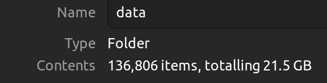

# Speech Recognition for spoken Afrikaans and isiXhosa
The basic aim of this project is to recognize spoken numbers for math games 
in Afrikaans and isiXhosa. The end-goal of the project is to perform 
general speech recognition for primary educational games in Afrikaans and 
isiXhosa.

## How to run
Read through the ``src/main.ipynb`` notebook.

## Datasets

### Datasets I am using
| Webpage Link | Language | Number of data entries | Additional info |
|--------------|----------|------------------------|-----------------|
|**NHCLT**||||
| [nchlt isixhosa](https://repo.sadilar.org/handle/20.500.12185/279)                 | xh      | 46651       | 107 different female speakers and 103 different male speakers. Xhosa speaker split: 103/99, 0/0, 4/4. There is also age information. |
| [nchlt afrikaans](https://repo.sadilar.org/handle/20.500.12185/280)                | af      | 66133       | 106 different female speakers and 103 different male speakers. Afrikaans speaker split: 102/99, 0/0, 4/4. There is also age information. |
|**Lwazi_ASR**||||
| [lwazi isixhosa asr](https://repo.sadilar.org/handle/20.500.12185/460)             | xh      | 6300        | 210 different speakers (30 sentences each): 107 female speakers and 101 male speakers (2 unknown). The examples for each speaker are not very long, and the transcritptions need to be preprocessed in their own way. The spoken sentences are the same for every speaker. There is also age information. Cellphone quality recordings. |
| [lwazi afrikaans asr](https://repo.sadilar.org/handle/20.500.12185/434)            | af      | 6000        | 200 different speakers (30 sentences each): 98 female speakers and 101 male speakers (1 unknown). The examples for each speaker are not very long, and the transcritptions need to be preprocessed in their own way. The spoken sentences are the same for every speaker. There is also age information. Cellphone quality recordings. |
|**High_Quality_TTS**||||
| [high quality tts](https://repo.sadilar.org/handle/20.500.12185/527)               | af + xh | 2927 + 2420 | Afrikaans: 9 different female speakers and 0 male speakers. Xhosa: 12 different female speakers and 0 male speakers. |
|**Fleurs_ASR**||||
| [hugging face fleurs](https://huggingface.co/datasets/google/fleurs)               | af + xh | 1494 + 4953 | Afrikaans amount split: 941/91, 0/198, 0/264. Xhosa amount split: 2471/995, 0/446, 0/1041. |

<!-- ### Datasets I am not using
| Webpage Link | Language | Number of data entries | Additional info |
|--------------|----------|------------------------|-----------------|
|**African_Speech_Tech**||||
| [african speech tech (xh)](https://repo.sadilar.org/handle/20.500.12185/305)       | xh      | Not sure.   | Struggling with the format of the dataset. The audio files are in ``.alaw`` format and the full sentence transcriptions are not given (they provide ``.TextGrid`` files). |
| [african speech tech (af)](https://repo.sadilar.org/handle/20.500.12185/400)       | af      | Not sure.   | Struggling with the format of the dataset. The audio files are in ``.alaw`` format and the full sentence transcriptions are not given (they provide ``.TextGrid`` files). |
|**Coloured/black Afrikaans**||||
| [coloured afrikaans](https://repo.sadilar.org/handle/20.500.12185/444)             | af      | Not sure.   | Struggling with the format of the dataset. The audio files are in ``.alaw`` format and the full sentence transcriptions are not given (they provide ``.TextGrid`` files). |
| [black afrikaans](https://repo.sadilar.org/handle/20.500.12185/422)                | af      | Not sure.   | Struggling with the format of the dataset. The audio files are in ``.alaw`` format and the full sentence transcriptions are not given (they provide ``.TextGrid`` files). |
|**Multipron corpus**||||
| [multipron corpus](https://repo.sadilar.org/handle/20.500.12185/379)               | af      | ~2500-3000  | Proper names dataset. 7 female speaker and 6 male speakers. | -->

<!-- ## Progress (11/08/2023)
   1. Downloaded Afrikaans and isiXhosa TTS datasets.
   2. Performed preprocessing to convert data into Dataset format for huggingface.
   3. Created a train/validation/test set from the data.
   4. Bare minimum text normalization for the label/sentences/transcripts.
   5. Imported large XLS-R model and fine-tuned with Afrikaans data + saved a model.

## Questions for Herman (11/08/2023)
   1. **Question:** What's next? In what direction are we heading towards?
        - **Answer:** First clean up pipeline and sort out datasets.
   2. **Question:** Should diacritics be removed? Other preprocessing tips?
        - **Answer:** No, keep it as simple as possible.
   3. **Question:** I'm not entirely sure what a sensible method is for 
      choosing a validation/test set. Right now I am splitting
      randomly.
        - **Answer:** Choose test/validation set very carefully & don't split randomly.
   4. **Question:** Should I remove the English sentences from the Afrikaans and
      isiXhosa datasets?
        - **Answer:** No.
   5. **Question:** Siswati or isiXhosa?
        - **Answer:** Use isiXhosa for now.

## Progress (18/08/2023)
   1. Downloaded more datasets.
   2. Familiarized with HuggingFace hub and can now load and store models.
   3. Further research into how XLS-R works.

## Questions for Herman (18/08/2023)
   1. **Question:** *(More for myself)* Why are NNs preferred over other 
   machine learning algorithms for the problem of speech recognition?
        - **ChatGPT answer:** In summary, neural networks are preferred for 
        automatic speech recognition due to their capacity for automatic 
        feature learning, end-to-end modeling, robustness to variability, 
        utilization of large-scale data, and adaptability through transfer 
        learning. These characteristics collectively contribute to their 
        superior performance in ASR tasks.
        - **Herman answer:** Over the years NNs started to perform much better
        than the goto models, which were HMMs at the time.
   2. **Question:** Why do people use less data entries in their dev sets than in their test sets?
        - **Answer:** Could be for many different reasons. Typically, the dev set
        is small so that the training set can be as large as possible. -->

## Progress (29/08/2023)
   1. Completed dataset exploration. Unfortunately, more than half of the datasets
   which I downloaded/requested are either (1) not available anymore, (2) impractical format,
   or (3) are not useful for ASR tasks (eg. datasets that contain limited number of speakers).
   2. Read through the literature of ASR, which includes research papers and textbook chapters.
   I also made hand-written summaries of the resources which I thought were important. 
   The table below provides a summary of the papers/resources which I either read or summarized.

| Resource | Progress | Extra notes |
|-|-|-|
| Attention is all you need | Read and summarized. | Relatively straight forward. | 
| wav2vec & vq-wav2vec | Skimmed over. | wav2vec 2.0 builds on this work.|
| wav2vec 2.0 | Read and summarized. | I don't understand all the main parts yet, but went over everything at least once. |
| Speech and Language processing (Ch. 16) | Read and summarized. | Provides a great introduction and background of the ASR field. Leaves out self-supervision techniques. |
| XLS-R | Read and summarized. | I used this paper as a starting point to recurse through bibliographies. |
| Layer Normalization | Skimmed over. | Relatively straight forward. |
| Gaussian error linear units | Skimmed over. | Relatively straight forward. |
| Whisper (OpenAI) | Skimmed over. | Does not rely on self-supervised pretraining. Relies on massive dataset and supervised techniques. | |
| Speech SimCLR | Todo. | Todo. |
| MAESTRO | Todo. | Todo. |
| mSLAM | Todo. | Todo. |
| Methods to Optimize Wav2Vec in Resource Constrained Environment | Todo. | Todo. |
| Optimizing Wav2Vec for small datasets | Todo. | Todo. |
| Fourier Features Let Networks Learn High Frequency Functions in Low Dimensional Domains| Todo. | Not really part of the literature, just want to read for interest sake. | 

## Questions for Herman (29/08/2023)
   1. **Discussion:** I can see two approaches of creating a train/val/test set.
   The 1st approach is to use seperate datasets (NCHLT, Fleurs, high-quality-tts, etc.)
   for each of the train/val/test sets. The 2nd approach is to create a train/val/test
   set from each dataset (NCHLT, Fleurs, high-quality-tts, etc.) and then to combine
   each training set to create the final training set, etc. ...

## References and Acknowledgements
The following is a rough summary of relevant resources.

### Papers and textbook chapters
You can find papers and textbook chapters in the ``notes`` directory.

### ChatGPT chats:
 - https://chat.openai.com/share/af4e27d1-3899-45b2-8917-bf3b5f6e669a
 - https://chat.openai.com/share/9da5e4fb-c90c-4050-aa62-045137ee0076
 - https://chat.openai.com/share/4885c5b0-1465-4cc9-a74b-a1282bf8ccc1

### Tutorial/blog webpages:
 - HuggingFace website contains numerous tutorials on how to use 
 the ``datasets`` and ``transformers`` library.
 - Fine-tuning tutorial: https://huggingface.co/blog/fine-tune-xlsr-wav2vec2

### YouTube videos:
 - Transformer Neural Networks explained: https://www.youtube.com/watch?v=TQQlZhbC5ps 
 - HuggingFace introduction: https://www.youtube.com/watch?v=QEaBAZQCtwE
 - Layer normalization short: https://youtube.com/shorts/TKPowx9fb-A?feature=share
 - Self-supervised learning explained: https://www.youtube.com/watch?v=iGJ1XSkCyU0
 - Beam search: https://www.youtube.com/watch?v=RLWuzLLSIgw
 - Refining beam search: https://www.youtube.com/watch?v=gb__z7LlN_4 
 - Watching neural networks learn: https://www.youtube.com/watch?v=TkwXa7Cvfr8&list=LL&index=18

