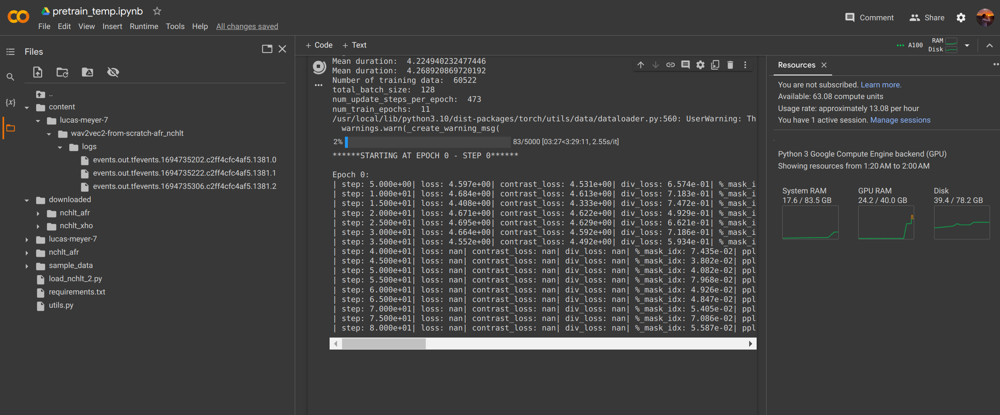
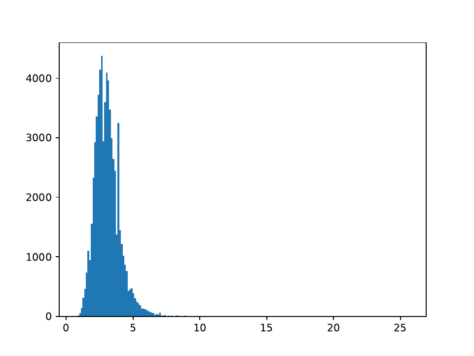
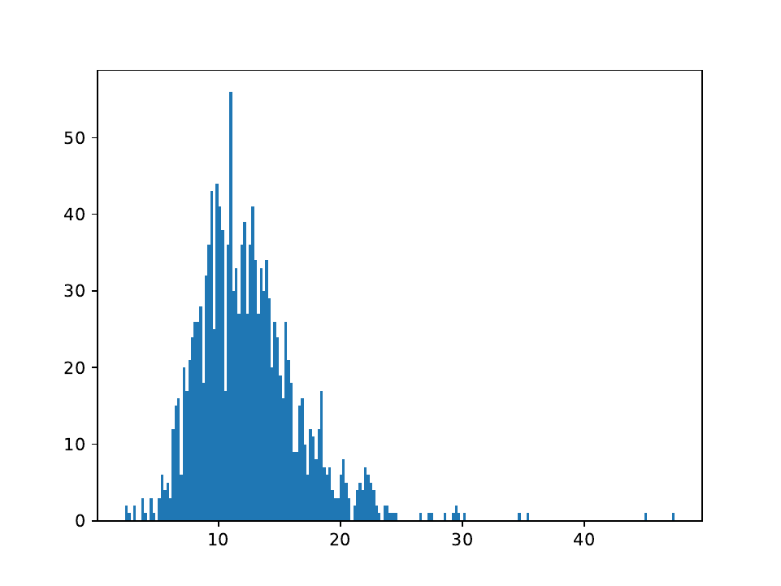

# Automatic Speech Recognition for Afrikaans & isiXhosa
The basic aim of this project is to perform automatic speech recognition for 
spoken Afrikaans and isiXhosa. 

## 1. How to run
Refer to the Python notebooks in the ``src`` directory.

## 2. Datasets
| Webpage Link | Language | Number of data entries | Additional info |
|--------------|----------|------------------------|-----------------|
|**NHCLT**||||
| [nchlt isixhosa](https://repo.sadilar.org/handle/20.500.12185/279)                 | xh      | 46651       | 107 different female speakers and 103 different male speakers. Xhosa speaker split: 103/99, 0/0, 4/4. There is also age information. |
| [nchlt afrikaans](https://repo.sadilar.org/handle/20.500.12185/280)                | af      | 66133       | 106 different female speakers and 103 different male speakers. Afrikaans speaker split: 102/99, 0/0, 4/4. There is also age information. |
|**High_Quality_TTS**||||
| [high quality tts](https://repo.sadilar.org/handle/20.500.12185/527)               | af + xh | 2927 + 2420 | Afrikaans: 9 different female speakers and 0 male speakers. Xhosa: 12 different female speakers and 0 male speakers. |
|**Fleurs_ASR**||||
| [hugging face fleurs](https://huggingface.co/datasets/google/fleurs)               | af + xh | 1494 + 4953 | Afrikaans amount split: 941/91, 0/198, 0/264. Xhosa amount split: 2471/995, 0/446, 0/1041. |

<!-- ## Datasets I am not using
| Webpage Link | Language | Number of data entries | Additional info |
|--------------|----------|------------------------|-----------------|
|**Lwazi_ASR**||||
| [lwazi isixhosa asr](https://repo.sadilar.org/handle/20.500.12185/460)             | xh      | 6300        | 210 different speakers (30 sentences each): 107 female speakers and 101 male speakers (2 unknown). The examples for each speaker are not very long, and the transcritptions need to be preprocessed in their own way. The spoken sentences are the same for every speaker. There is also age information. Cellphone quality recordings. |
| [lwazi afrikaans asr](https://repo.sadilar.org/handle/20.500.12185/434)            | af      | 6000        | 200 different speakers (30 sentences each): 98 female speakers and 101 male speakers (1 unknown). The examples for each speaker are not very long, and the transcritptions need to be preprocessed in their own way. The spoken sentences are the same for every speaker. There is also age information. Cellphone quality recordings. |
|**African_Speech_Tech**||||
| [african speech tech (xh)](https://repo.sadilar.org/handle/20.500.12185/305)       | xh      | Not sure.   | Struggling with the format of the dataset. The audio files are in ``.alaw`` format and the full sentence transcriptions are not given (they provide ``.TextGrid`` files). |
| [african speech tech (af)](https://repo.sadilar.org/handle/20.500.12185/400)       | af      | Not sure.   | Struggling with the format of the dataset. The audio files are in ``.alaw`` format and the full sentence transcriptions are not given (they provide ``.TextGrid`` files). |
|**Coloured/black Afrikaans**||||
| [coloured afrikaans](https://repo.sadilar.org/handle/20.500.12185/444)             | af      | Not sure.   | Struggling with the format of the dataset. The audio files are in ``.alaw`` format and the full sentence transcriptions are not given (they provide ``.TextGrid`` files). |
| [black afrikaans](https://repo.sadilar.org/handle/20.500.12185/422)                | af      | Not sure.   | Struggling with the format of the dataset. The audio files are in ``.alaw`` format and the full sentence transcriptions are not given (they provide ``.TextGrid`` files). |
|**Multipron corpus**||||
| [multipron corpus](https://repo.sadilar.org/handle/20.500.12185/379)               | af      | ~2500-3000  | Proper names dataset. 7 female speaker and 6 male speakers. | -->

## 3. Reading material
| Resource | Progress | Extra notes |
|-|-|-|
| Attention is all you need | Read and summarized. | Relatively straight forward. | 
| wav2vec & vq-wav2vec | Skimmed over. | wav2vec 2.0 builds on this work.|
| wav2vec 2.0 | Read and summarized. | I don't understand all the main parts yet, but went over everything at least once. |
| Speech and Language processing (Ch. 16) | Read and summarized. | Provides a great introduction and background of the ASR field. Leaves out self-supervision techniques. |
| XLS-R | Read and summarized. | I used this paper as a starting point to recurse through bibliographies. |
| Layer Normalization | Skimmed over. | Relatively straight forward. |
| Gaussian error linear units | Skimmed over. | Relatively straight forward. |

<!-- ### Progress (11/08/2023)
   1. Downloaded Afrikaans and isiXhosa TTS datasets.
   2. Performed preprocessing to convert data into Dataset format for huggingface.
   3. Created a train/validation/test set from the data.
   4. Bare minimum text normalization for the label/sentences/transcripts.
   5. Imported large XLS-R model and fine-tuned with Afrikaans data + saved a model.

### Questions for Herman (11/08/2023)
   1. **Question:** What's next? In what direction are we heading towards?
        - **Answer:** First clean up pipeline and sort out datasets.
   2. **Question:** Do you expect me to implement and train a similar model from scratch?
        - **Answer:** ...
   3. **Question:** Should diacritics be removed? Other preprocessing tips?
        - **Answer:** No, keep it as simple as possible.
   4. **Question:** I'm not entirely sure what a sensible method is for 
      choosing a validation/test set. Right now I am splitting
      randomly.
        - **Answer:** Choose test/validation set very carefully & don't split randomly.
   5. **Question:** Should I remove the English sentences from the Afrikaans and
      isiXhosa datasets?
        - **Answer:** No.
   6. **Question:** Siswati or isiXhosa?
        - **Answer:** Use isiXhosa for now.

### Progress (18/08/2023)
   1. Downloaded more datasets.
   2. Familiarized with HuggingFace hub and can now load and store models.
   3. Further research into how XLS-R works.
   4. Research into how OpenAI's whisper works.

### Questions for Herman (18/08/2023)
   1. **Question:** *(More for myself)* Why are NNs preferred over other 
    machine learning algorithms for the problem of speech recognition?
   machine learning algorithms for the problem of speech recognition?
         - **ChatGPT answer:** In summary, neural networks are preferred for 
         automatic speech recognition due to their capacity for automatic 
         feature learning, end-to-end modeling, robustness to variability, 
         utilization of large-scale data, and adaptability through transfer 
         learning. These characteristics collectively contribute to their 
         superior performance in ASR tasks.
   2. Is the development set the same as the validation set? Why do people use
   less data entries in their dev sets than in their test sets?
         - **Herman answer:** Over the years NNs started to perform much better
         than the goto models, which were HMMs at the time.
   3. **Question:** Is the development set the same as the validation set? 
   Why do people use less data entries in their dev sets than in their test sets?
         - **Answer:** Could be for many different reasons, but most likely it is
         small so that the training set can be as large as possible.

### Progress (29/08/2023)
   1. Completed dataset exploration. Unfortunately, more than half of the datasets
   which I downloaded/requested are either (1) not available anymore, (2) impractical format,
   or (3) are not useful for ASR tasks (eg. datasets that contain limited number of speakers).
   2. Read through the literature of ASR, which includes research papers and textbook chapters.
   I also made hand-written summaries of the resources which I thought were important. 
   The table below provides a summary of the papers/resources which I either read or summarized.

### Questions for Herman (29/08/2023)
   1. **Discussion:** I can see two approaches of creating a train/val/test set.
   The 1st approach is to use seperate datasets (NCHLT, Fleurs, high-quality-tts, etc.)
   for each of the train/val/test sets. The 2nd approach is to create a train/val/test
   set from each dataset (NCHLT, Fleurs, high-quality-tts, etc.) and then to combine
   each training set to create the final training set, etc.
         - **Conclusion:** Go for the 2nd approach, makes result section better.

### Progress (02/09/2023)
   1. **Finished dataset (DS) splits** for Afrikaans-exclusive DS, isiXhosa-exclusive DS, 
   and Afrikaans-isiXhosa-combined DS.
   2. **Uploaded Afrikaans-exclusive** DS to the HuggingFace [hub](https://huggingface.co/datasets/lucas-meyer/asr_af).
   3. **Continued reading** through the literature of ASR.

### Questions for Herman (02/09/2023)
   1. **Discussion:** If the data is already downloaded, then it takes
   about 3 minutes to load the Afrikaans-exclusive dataset from disk. 
   However, when using Google Colab it takes about 30 minutes to load 
   the Afrikaans-exclusive dataset from the HuggingFace hub. This is one
   of the reasons why I think using Google Colab will be a painful experience.
   Are there any available *super*-computers that I can get access to?

### Progress (08/09/2023)
   1. (Mon \& Tue) Familiarized myself with HPC1, and set SSH up with VPN.
   2. (Wed, Thu \& Fr) Tried to train xls-r model (300M) with ~ 65K Afrikaans instances. It became clear to me that having a GPU does not necessarily solve my previous issues. The main issue: Running out of GPU memory. There are few more ways to optimize GPU memory usage that I haven't tried (e.g. using a fully sharded backend).

### Questions for Herman (08/09/2023)
   1. **Discussion:** Should I continue trying to train the 300M xls-r model and/or the tiny/small whisper model using Huggingface? OR, should I try to implement the same models without using HuggingFace (i.e. only PyTorch.audio ...). My opinion is that HuggingFace is convenient, however there is less control. I would like to give HuggingFace one last chance over the weekend, since there are some things I can still try. However, I think that if Monday comes and I still don't have anything, I would like to try implementing it using the audio package from PyTorch (they have built-in support for CTC and Wav2Vec2).
      - **Answer:** Try to fine-tune one model on HF if you can. Use ``fairseq`` for the rest.
   2. **Discussion:** Would like to discuss potential research questions that we can answer. Would appreciate if you could give input and raise any potential concerns.
      - **Answer:** Three tiers of goals: (1) Fine-tune XLS-R to Afrikaans and isiXhosa. (2) Compare pretraining from scratch + finetuning VS. finetuning a pretrained model. (3) Pretraining on isiXhosa, finetuning on Zulu.

### Progress (15/09/2023)
   1. **Monday:** Finished presentation and prepared speech. Established three tiers of end-goals: 
      1. Fine-tune XLS-R to Afrikaans and isiXhosa.
      2. Comparison: Pretraining wav2vec2 from scratch + finetuning VS. finetuning a pretrained XLS-R model.
      3. Comparison: Pretraining on isiXhosa and finetuning on Zulu VS. pretraining on Afrikaans and finetuning on Zulu.
   2. **Tuesday:** Researched wav2vec2 pretraining and ran fine-tuning script on Google Colab.
   3. **Wednesday:** Started with report layout, continued struggling with HPC and eventually gave up.
   4. **Thursday:** Bought GC compute unnits, fine-tuned XLS-R with AF data (excl. NCHLT data).
   I also started pretraining a wav2vec model from scratch using HuggingFace and the AF NCHLT dataset.
   5. **Friday:** Edited README and prepared for meeting, not much yet. I am looking at the following things at the moment:
      - Continue to fine-tune XLS-R 300M model using different hyperparameter values. Since the model overfits,
      I would like to decrease the learning rate and introduce callbacks like EarlyStopping.
      - Try to train a wav2vec2 model from scratch using the NCHLT data. The issue right now is that I am getting NaN loss
      and cosine similarity. According to some online users the issue arises from having a too large learning rate 
      (or too small batch size).
      - Write a little bit of the *background* and *related work* sections of the report.

### Questions for Herman (15/09/2023)
   1. **Question:** Can you comment on the three tiers of end-goals for the project. Is it too little/much? Is it over/under-ambitious?
   2. **Question:** Can we talk about installing a computer in the Media Lab?
   3. **Question:** Do you think it is fine to use NCHLT data for pretraining and the rest of the data for fine-tuning?
   4. **Question:** (``if answer_q2 == "no"``) Where can I find unsupervised speech data?
   5. **Question:** From your experience with ASR models, could you find a positive correlation between the learning rate and batch size?
   6. **Question:** What should I focus on the most?
   6. **Question:** Can you please help me with the layout of the report?

### Progress (21/09/2023)
   1. **Monday:** Fine-tune XLS-R to Afrikaans and isiXhosa. Started coding LM boosting.
   2. **Tuesday:** Finished LM boosting notebook. Tried LM boosted model, but config and LM alphabet did not align.
   3. **Wednesday:** Fixed config, LM boosted model works.

### Questions for Herman (21/09/2023)
   1. **Question:** Which data should I use for the LM? I don't think the Wiki data is enough.
   2. **Question:** Could you comment on my vocab and the characters which I am removing?
   3. **Question:** What should I have written before our next meeting, and should I aim to finish the pretraining script as well? -->

## 4. Progress Update & Questions

### 4.1 Progress (28/09/2023)
   1. Coding:
      - Dataset analysis - we can discuss later.
      - Prepared more language data by adding the transcription data from the ASR training set.
      - Prepared everything else required for running experiments.
   2. Report writing:
      - Completed 80% of "Background" section.
      - Created outline for the remainder of the report.
   
### 4.2 Questions for Herman (06/10/2023)
**Main discussion points of meeting:**
   1. The way in which I should be conducting experiments with the hyperparameters of ``Wav2vec2`` models and the ``KenLM`` $n$-gram models.
   2. Fine-tuning several different pretrained ``Wav2vec2`` based models.
   3. Using other SA languages such as Siswati and Zulu?

### 4.2.1 Coding questions (06/10/2023)
   1. **Question:** Do you have the already processed LM data from WikiMedia? I am struggling to find a simple solution to clean the data desirably.
   2. **Question:** I would like to use the NCHLT data as well, since I am not performing pretraining anymore. Should I use it, even though its sh\*t?
   3. **Discussion:** (Loosely-related to previous) How to remove the outliers of each dataset? I have created histograms that describe the durations of all entries for each of the three datasets.

#### 4.2.1.1 Duration histograms (bins = 200)

NCHLT             |  NCHLT after removing outliers (95% CI)
:-------------------------:|:-------------------------:
  |  

FLEURS            |  FLEURS after removing outliers (95% CI)
:-------------------------:|:-------------------------:
  |  

High-quality TTS             |  High-quality TTS after removing outliers (95% CI)
:-------------------------:|:-------------------------:
  |  

### 4.2.2 Report writing questions (06/10/2023)
   1. **Question:** Is [this](https://www.overleaf.com/latex/templates/stellenbosch-university-statistics-and-actuarial-science-thesis-template/kvvvzcgntntt) the correct template that you wanted me to use?
   2. **Question:** Does the research project count as a module (since it is not an actual thesis)?
   3. **Question:** Should I use "ASR" / "automatic speech recognition" or just simply "speech recognition" or both interchangeably?
   4. **Discussion:** The outline of "Background".
   5. **Discussion:** The outline of "Methodology" / "Experimental Setup" / "Emperical Procedure"?
   6. **Question:** What should be included and what should be omitted when discussing datasets?
   7. **Discussion:** The outline of the rest of the report.

### 4.2.3 Questions unrelated to project (06/10/2023)
   1. **Question:** Can you give your own biased opinion on working straight after Masters? Can you also give your opinion on doing a PhD straight after Masters? I'm at a bit of a crossroads, since I believe in my capabilities to do either (work/research)... Finally, can you give your opinion on doing both (working while doing research/PhD)?
   2. **Question:** I am thinking about applying for a job next year. I would like to work with Audio + ML (speech, music, etc.). 
   Do you have any connections/recommendations for me? Trackosaurus education?

## 5. References and Acknowledgements

### 5.1. Research papers and textbooks
Refer to the references section in the final report.

### 5.2. Other resources
 - (Docs) HuggingFace [datasets](https://huggingface.co/docs/datasets/index) and [transformers](https://huggingface.co/docs/transformers/index).
 - (Docs) HuggingFace [Wav2Vec2](https://huggingface.co/docs/transformers/model_doc/wav2vec2) documentation.
 - (Blogpost) [XLS-R Fine-tuning tutorial](https://huggingface.co/blog/fine-tune-xlsr-wav2vec2)
 - (Blogpost) [Boosting Wav2Vec2 with n-grams](https://huggingface.co/blog/wav2vec2-with-ngram)
 - (Blogpost) [The Illustrated Transformer](https://jalammar.github.io/illustrated-transformer/)
 - (YT video) [Transformer Neural Networks explained](https://www.youtube.com/watch?v=TQQlZhbC5ps)
 - (YT video) [GELU](awe)
 - (YT video) [Layer normalization](https://youtube.com/shorts/TKPowx9fb-A?feature=share)
 - (YT video) [Grouped convolution](https://www.youtube.com/watch?v=3NU2vV3XD8c)
 - (YT video) [Self-supervised learning explained](https://www.youtube.com/watch?v=iGJ1XSkCyU0)
 - (YT video) [Beam search](https://www.youtube.com/watch?v=RLWuzLLSIgw) and [Refining beam search](https://www.youtube.com/watch?v=gb__z7LlN_4)